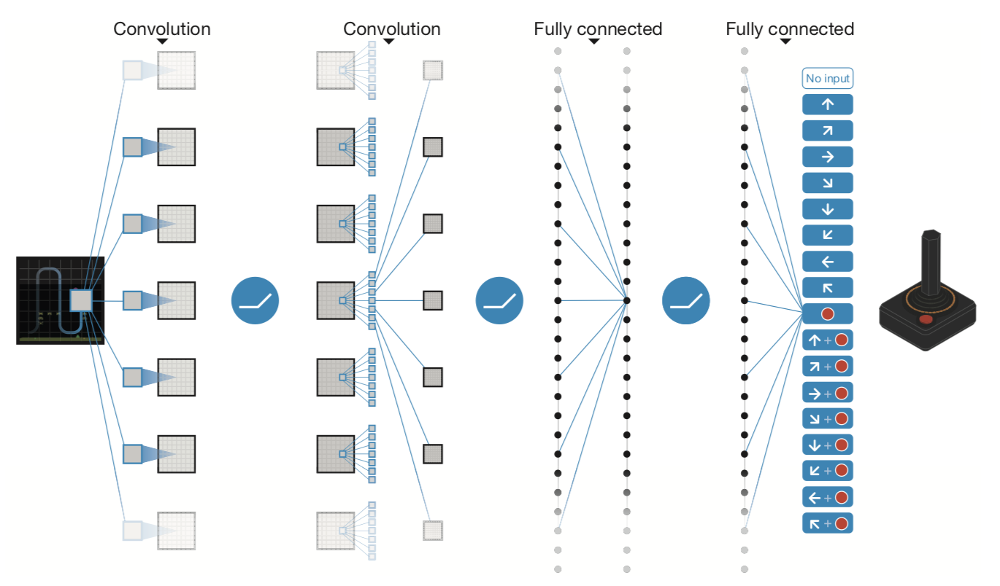
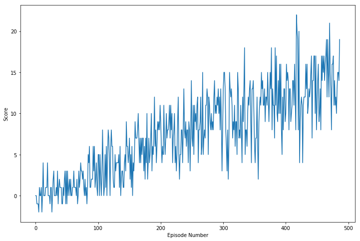

[//]: # (Image References)

# Project 1: Navigation

### Introduction

For this project, we will train an agent that learns by himself (trials and errors) to navigate and collect a type of bananas in a large, square world.  

 
     

A reward of +1 is provided for collecting a yellow banana, and a reward of -1 is provided for collecting a blue banana.  Thus, the goal of our agent is to collect as many yellow bananas as possible while avoiding blue bananas.  

The state space has 37 dimensions and contains the agent's velocity, along with ray-based perception of objects around agent's forward direction.  Given this information, the agent has to learn how to best select actions.  Four discrete actions are available, corresponding to:
- **`0`** - move forward.
- **`1`** - move backward.
- **`2`** - turn left.
- **`3`** - turn right.

The task is episodic, and in order to solve the environment, our agent must get an average score of +13 over 100 consecutive episodes.

Our problem is well framed to be categorized as a [**Reinforcement Learning**](https://s3-us-west-1.amazonaws.com/udacity-drlnd/bookdraft2018.pdf) problem.

### Getting Started

1. Download the environment from one of the links below.  You need only select the environment that matches your operating system:
    - Linux: [click here](https://s3-us-west-1.amazonaws.com/udacity-drlnd/P1/Banana/Banana_Linux.zip)
    - Mac OSX: [click here](https://s3-us-west-1.amazonaws.com/udacity-drlnd/P1/Banana/Banana.app.zip)
    - Windows (32-bit): [click here](https://s3-us-west-1.amazonaws.com/udacity-drlnd/P1/Banana/Banana_Windows_x86.zip)
    - Windows (64-bit): [click here](https://s3-us-west-1.amazonaws.com/udacity-drlnd/P1/Banana/Banana_Windows_x86_64.zip)
    
    (_For Windows users_) Check out [this link](https://support.microsoft.com/en-us/help/827218/how-to-determine-whether-a-computer-is-running-a-32-bit-version-or-64) if you need help with determining if your computer is running a 32-bit version or 64-bit version of the Windows operating system.

    (_For AWS_) If you'd like to train the agent on AWS (and have not [enabled a virtual screen](https://github.com/Unity-Technologies/ml-agents/blob/master/docs/Training-on-Amazon-Web-Service.md)), then please use [this link](https://s3-us-west-1.amazonaws.com/udacity-drlnd/P1/Banana/Banana_Linux_NoVis.zip) to obtain the environment.

2. Place the file in the `p1_Navigation/` folder, and unzip (or decompress) the file. 

### Instructions

Follow the instructions in `Navigation.ipynb` to get started with training the agent. To solve this problem we use a [**Deep Q-Networks**](https://storage.googleapis.com/deepmind-media/dqn/DQNNaturePaper.pdf). 

 
     

We have **37 continuous states**, **4 discrete actions**. When  the training is done, we can inspect plot of rewards per episode.

 
    

 <em><b>Plotted Rewards</b></em> 

### Future works

>[Learning from Pixels](https://github.com/nalbert9/Deep_Reinforcement_Learning/blob/master/P1_Navigation/Navigation_Pixels.ipynb)

In the project, our agent will learn from information such as its velocity, along with ray-based perception of objects around its forward direction.  A more challenging task would be to learn directly from pixels.

>[ solve Lunar-Lander environment with DQN](https://gym.openai.com/envs/LunarLander-v2/)
